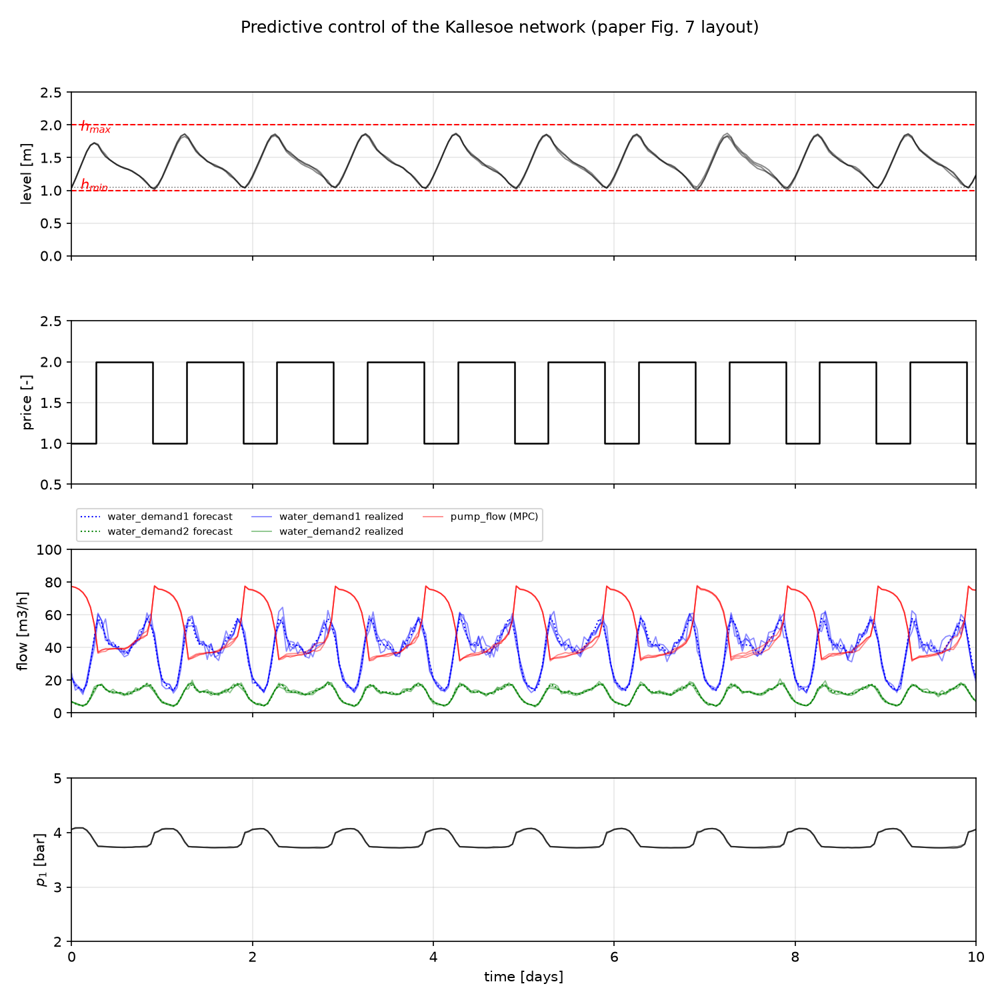

# Reimplementation of Water tower environment

Unofficial implementation of the water-tower case study of

Kallesøe, Carsten Skovmose, Tom Nørgaard Jensen, and Jan Dimon Bendtsen. "Plug-and-play model predictive control for water supply networks with storage." IFAC-PapersOnLine 50.1 (2017): 6582-6587.

The open-loop run follows this 2017 paper (v1); the receding-horizon closed
loop follows the v2 architecture of

> C. S. Kallesøe et al., IFAC-PapersOnLine 56-2 (2023) 749–754,

with mean-scaled stochastic demand, chance-constrained level bounds and a
local safety controller.  Equation numbers without a version refer to v1;
v2 equations are marked explicitly.

The folder is self-contained: the run script with its plotting module
`kallesoe_plot.py`, the data extracted from the paper's figures in `data/`,
and every output written next to the script.

## Run

```sh
python fit_models.py                            # identify g_lambda, g_mu, f_theta -> data/model.json
python kallesoe_mpc.py                          # open-loop economic MPC (v1) + figure
python kallesoe_mpc.py --receding               # 24 h receding-horizon closed loop (v2),
                                                # 3 stochastic realizations overlaid
python kallesoe_mpc.py --receding --no-chance   # ablation: v1 deterministic bounds
python kallesoe_mpc.py --receding --seeds 4 5   # custom noise seeds (default: 1 2 3)
python kallesoe_mpc.py --v-exact                # eq. (18) exact interval integrals
python kallesoe_mpc.py --kappa-ramp 0.003       # v2 (13a) control-ramp cost, default 0
python kallesoe_mpc.py --no-plot                # skip the figure
```

Dependencies: `numpy`, `scipy`, `casadi` (with IPOPT), `matplotlib` (figure).
A `requirements.txt` pins the versions the loop runs on.

`fit_models.py` identifies both demand models and the friction model from the
digitised series and writes every fitted parameter to `data/model.json`,
which the run script loads.  A fitted `data/model.json` ships with the
folder, so fitting is only needed if you change the data or the fit.  The
shipped file pairs the 12-harmonic demand fit with the friction weights of
the canonical Kallesoe refit (`th1 = 2.8e-5`, `th3 = 6.2e-5`, `th5 = 0.515`),
the set the WaterTower IOC studies freeze for this network.  Rerunning
`fit_models.py` refits the friction from the digitised series by NNLS instead
(`th5 = 0.336`, 0.070 bar RMSE); the demand fit RMSE is 1.15 m3/h for zone 1
and 0.34 for zone 2.

## Model and its equations

The reduced network has one pump station (supply flow `d1`), one elevated
reservoir (level `h`, area `A = 400 m2`) and two pressure zones whose demands
are `water_demand1` (pressure zone 1) and `water_demand2` (pressure zone 2).
The code comments carry the equation numbers; the map is:

| Paper | What | Where |
| --- | --- | --- |
| (8), (10) | Pressure-zone-1 demand (paper: `water_demand1 = g_lambda/lambda0`; here `g_lambda` is fitted directly in m3/h, see the units note under eq. (18)), truncated Fourier series, identified by least squares | `fit_models.py` -> `g_lambda` |
| (11) | Pressure-zone-2 demand `water_demand2 = g_mu`, same Fourier structure | `fit_models.py` -> `g_mu` |
| (12), (13) | reduced network `p1 - pn = f_theta(d1, t)`, five-term friction/head, NNLS identification | `fit_models.py` -> `f_theta` |
| (2), (20) | `pn = alpha*(h + h0)`, `p1 = f_theta + alpha*h` | `friction`/`pressure_power`, MPC stage cost |
| (14a) | economic cost, price x electrical power, plus `kappa` terminal term | `make_mpc` objective |
| (14b), (18) | `h_k+1 = h_k + (dt/A)*d1_k - (v_lambda_k + v_mu_k)/A`; the interval consumptions `v_lambda`, `v_mu` default to the eq. (23c) stand-in `dt*g(t_k)`, `--v-exact` integrates the Fourier rate over `[t_k, t_k + dt]`; the plant steps the realized consumptions | `make_mpc` (`water_consumption1/2`), `eval_demand_model`, `step_plant` |
| (14c) | `p1 = f_theta(d1, t) + alpha*h` | `make_mpc` |
| (14d) | `h_min <= h <= h_max`, `0 <= d1 <= D1_MAX` | `opti.bounded` in `make_mpc` |
| (15)-(17), (23c) | water-quality exchange, `0.5*sum(|dt*d1 - v_lambda| + v_mu)*24/(steps*dt) >= WATER_QUALITY` (exact volume form, any horizon) | exchange constraint in `make_mpc` |
| v2 (2) | demand noise, std scaled with the mean demand | `realize_demand` |
| v2 (13f), (14) | chance-constrained level bounds, naive one-step form of Remark 1 | `level_margin` in `make_mpc`/`solve_mpc` |
| v2 Sec. 3.2 | local safety controller (flow projection, simplified) | `apply_safety` |
| v2 (13a) | control-ramp cost `kappa_ramp * sum (d1_k - d1_k-1)^2`, off by default, `--kappa-ramp` to switch on | `make_mpc` |

Fixed physics and identified constants: `alpha = 0.1`, `h0 = 30 m`,
`p0 = 2.408 bar`, `eta = 0.65`, `kappa = 0.0629`, and the water-quality
exchange threshold `WATER_QUALITY = 100` m3/day (assumed, see (17)/(23c)
below).  `D1_MAX` is derived from the data as max(observed `d1`) + 20 m3/h
(with the day-0 start this includes the on/off startup spike, so the bound is
generous; the MPC itself never exceeds ~80 m3/h) and the initial level is the
digitised level at hour 0.  The default Fourier order is 12 harmonics
(`--harmonics N` to change).

## MPC formulation

Notation follows the papers: $d_1$ is the supply flow, $h$ the reservoir
level, $p_0$ and $p_1$ the inlet and outlet pressure of the pumping station,
$c(t)$ the known electricity price, $\eta$ the pump efficiency, $\kappa$ the
terminal weight, $\lambda_0 = 1/A$ the reservoir unit transfer with area $A$,
$\alpha$ the level-to-pressure scaling, $g_\lambda$ and $g_\mu$ the demand
prediction models of PZ1 and PZ2, $\Delta t = 1$ h the sampling time, $M$ the
prediction horizon in samples ($M \Delta t = T$), and $t_0$ the current time.
Samples are taken at $t_i = t_0 + i \Delta t$ for $i = 1, \dots, M$, and all
flows are piecewise constant between samples.

### Open loop (v1)

The continuous problem is (14):

$$
\min_{d_1} \int_{t_0}^{t_0+T} \frac{2 c(\tau) ( p_1(d_1, h, \tau) - p_0 ) d_1(\tau)}{\eta} d\tau + \kappa ( h(t_0 + T) - h(t_0) )^2 \qquad (14a)
$$

$$
A \dot h(t) = d_1(t) - \frac{1}{\lambda_0} g_\lambda(t) - g_\mu(t) \qquad (14b)
$$

$$
p_1(d_1, h, t) = f_\theta(d_1, t) + \alpha h \qquad (14c)
$$

$$
0 \leq \underline{h} \leq h(t) \leq \bar{h}, \qquad 0 \leq d_1(t) \leq \bar{d}_1 \qquad (14d)
$$

Integrating (14b) over one sample with $\Delta t = 1$ h gives the discrete
dynamics used by the solver.  By default the demand enters as the sampled
stand-in of paper eq. (23c), $v_i = \Delta t\, g(t_i)$, which is the
convention the recorded reproduction runs use.  With `--v-exact` the
consumption is instead the exact interval integral of paper eq. (18)
(`eval_demand_model` differences the antiderivative of the same Fourier
series over $[t_{i-1}, t_i]$):

$$
h(t_i) = h(t_{i-1}) + \frac{\Delta t}{A} d_1(t_i) - \frac{1}{A} \left( v_\lambda(t_i) + v_\mu(t_i) \right), \qquad
v_\lambda(t_i) = \int_{t_{i-1}}^{t_i} \frac{1}{\lambda_0} g_\lambda(\tau) d\tau \qquad (18)
$$

**Units of `g_lambda`.**  (18) quotes the paper, whose $g_\lambda$ is *not* a
flow: the paper identifies it from pressure samples via (9)-(10) (linear in
$(\lambda_0, \lambda)$), so it carries units of level rate, and the user
demand is $\bar d = A\, g_\lambda = \frac{1}{\lambda_0} g_\lambda$ (stated in
the paper just before eq. (12)); that is why (14b)/(18) carry the factor
$1/\lambda_0$ on $g_\lambda$ while $g_\mu$, fitted against the *measured
flow* $d_{n+1}$ in (11), appears without one.  `fit_models.py` instead fits
both Fourier models by least squares directly against the digitised m3/h
demand series, so the code's `g_lambda` already is the flow, with the paper's
$1/\lambda_0$ absorbed into the fitted
coefficients ($\texttt{g\_lambda}_\mathrm{code} = g_\lambda/\lambda_0$).
The same helper returns the interval consumption $v_\lambda$, so the dynamics
are symmetric in the two zones, `h += dt/A * d1 - (v_lambda + v_mu)/A`.

Since

$$
h(t_0 + T) - h(t_0) = \frac{\Delta t}{A} \sum_{i=1}^{M} \left( d_1(t_i) - \frac{1}{\lambda_0} g_\lambda(t_i) - g_\mu(t_i) \right) \qquad (21)
$$

the discrete problem solved by `make_mpc` (via IPOPT) is

$$
\min_{d_1(t_1), \dots, d_1(t_M)} \sum_{i=1}^{M} \frac{2 c(t_i) ( p_1(t_i) - p_0 ) d_1(t_i)}{\eta} \Delta t + \kappa \left( \frac{\Delta t}{A} \sum_{i=1}^{M} \left( d_1(t_i) - \frac{1}{\lambda_0} g_\lambda(t_i) - g_\mu(t_i) \right) \right)^2 \qquad (22)
$$

subject to

$$
\underline{h} \leq h(t_i) \leq \bar{h}, \qquad 0 \leq d_1(t_i) \leq \bar{d}_1 \qquad (23b)
$$

with $p_1(t_i)$ from (14c) and $h(t_i)$ from (18), plus the water-quality
exchange constraint (17), repeated as (23c): the tower turnover

$$
\frac{24}{M\Delta t} \, \frac{1}{2} \sum_{i=1}^{M} \left( | \Delta t\, d_1(t_i) - v_\lambda(t_i) | + v_\mu(t_i) \right) \;\geq\; V \qquad (17), (23c)
$$

with the threshold $V = 100\,\mathrm{m^3/day}$.  This is an assumption;
neither paper states $V$ (the WaterTower scripts use the same value).  The
day-scaling keeps the threshold horizon-independent.  At this network's data
the constraint is slack: over a periodic day the exchange measure cannot fall
below the PZ2 through-flow $\int \bar d_2 \approx 287\,\mathrm{m^3}$ (reached
exactly by pure demand tracking, the constant-price optimum), and the solves
realize $\approx 420\,\mathrm{m^3/day}$, so it guards against future
cost/price configurations rather than shaping the solution shown.  The supply
pressure $p_1$ and pump power of the cost and the post-solve diagnostics come
from the one pure function `pressure_power` (which composes `friction`), so
eq. (2)/(20) and the power conversion exist in a single place.  The open loop
takes $M = 241$ hourly samples over the full 10-day window with the nominal
Fourier demands $g_\lambda$ and $g_\mu$, and anchors the terminal term at
$h(t_0)$.

The stage cost as implemented is normalised to price times electrical power,
$c(t_i) ( p_1(t_i) - p_0 ) d_1(t_i) k_p / \eta$ with $k_p$ the
$\mathrm{bar \cdot m^3/h}$ to kW conversion, i.e. the factor 2 of (14a) is
absorbed.  The terminal term is anchored at the current level $h(t_0)$, the
paper's periodicity target $\kappa ( h(t_0+T) - h(t_0) )^2$, so the solver
needs no extra flow regulariser: the open-loop optimum is unique (verified
from flat initial guesses of 30 and 70 m3/h).

### Closed loop (v2, IFAC-PapersOnLine 56-2, 2023)

`--receding` replans every hour with $M = 24$ from the measured level,
applies the first flow, and steps the plant with the realized demand.
Three layers, matching the v2 architecture; the plant itself is
deterministic, the demand is the only stochastic input.

**Stochastic demand** (v2 eq. 2).  The consumption in zone $i$ is the mean
periodic profile plus noise whose variance scales with the mean:

$$
d_i(t) = \bar{g}_i(t) + \varepsilon_i(t), \qquad \varepsilon_i(t) \sim \mathcal{N} \left( 0, \sigma_i^2(\bar{g}_i(t)) \right), \qquad \sigma_i(t) = 2 \hat{\sigma}_i \frac{\bar{g}_i(t)}{\mathrm{mean}(\bar{g}_i)} \qquad (v2-2)
$$

with $\hat{\sigma}_i$ the residual std of the Fourier fit of zone $i$.  The
plant integrates the realized consumption over the sample, i.e. the interval
consumption $v_i$ of the forecast profile plus the same noise held
piecewise constant: $v_i^{realized}(t_k) = v_i(t_k) + \Delta t\, \varepsilon_i(t_k)$.

**Chance-constrained EMPC** (v2 eq. 13f/14).  The level constraints are
tightened by the one-step-ahead level uncertainty (the naive form of
Remark 1: the level error over one sample is $\lambda_0 \Delta t$ times the
demand error, and the covariance is not propagated):

$$
\underline{h} + \sigma(h, t) \leq h(t) \leq \bar{h} - \sigma(h, t), \qquad \sigma(h, t) = \Phi^{-1}(\alpha_{ch}) \lambda_0 \Delta t \sqrt{ \sigma_\lambda^2(t) + \sigma_\mu^2(t) } \qquad (v2-13f,14)
$$

with $\alpha_{ch} = 0.95$ and $\Phi$ the standard Gaussian cdf.  Disable the
tightening with `--no-chance` to recover the v1 deterministic bounds (14d).

**Local safety controller** (v2 Sec. 3.2, simplified).  This projects the
global controller's flow onto the set that keeps the next level within
bounds, priority to the upper (overflow) bound:

$$
d_1^{LSC} = \Pi_{\left[ \underline{u}, \bar{u} \right]} \left( d_1^{GC} \right), \qquad \bar{u} = \frac{\bar{v}^{(1)} + \bar{v}^{(2)}}{\Delta t} + \frac{\bar{h} - h(t_0)}{\lambda_0 \Delta t}, \qquad \underline{u} = \frac{\bar{v}^{(1)} + \bar{v}^{(2)}}{\Delta t} + \frac{\underline{h} - h(t_0)}{\lambda_0 \Delta t} \qquad (v2-18,23)
$$

then $d_1^{LSC}$ is clipped to $[0, \bar{d}_1]$.  The LSC runs hourly and uses
the forecast consumption in place of the paper's Kalman-filter estimate.  The
plant is never clipped.  Any residual violation is realized noise the hourly
safety layer cannot see and is reported per seed.

## The experiment (paper Sec. 4.1, Fig. 7)

The first two days of the paper's run identify the model; the controller then
takes over.  The open-loop run reproduces the v1 controlled phase directly;
the receding run reproduces it with the v2 closed loop described above:
at every hourly step the chance-constrained economic MPC solves (14) over a
24 h horizon from the measured level, the safety layer projects the first
control `d1(t0)`, and the plant advances with the *realized* demand, the
nominal forecast (8), (11) plus mean-scaled white noise (v2 eq. 2) at twice
the fit residual (about 1.4 m3/h for `water_demand1`, 0.4 for
`water_demand2` at the mean demand, i.e. about 7%); the measured residual
alone is model mismatch and would be invisible.  The figure shows realized
demands (solid) against the nominal forecasts (dashed).  The price `c(t)` is
the paper's designed repeating
signal (Fig. 7, middle): high by day, low at night.

## Data

| File | Content |
| --- | --- |
| `data/kallesoe_hourly.csv` | Digitised hourly series of Figs. 6-7 of the paper: reservoir level, price, `water_demand1`, `water_demand2`, `d1`, supply pressure (241 h) |
| `data/model.json` | All fitted parameters: `g_lambda`, `g_mu` Fourier coefficients per eq. (8)/(11) and the `f_theta` weights per eq. (12)/(13) |

## Output

`kallesoe_trajectory_openloop.csv` with columns
`t_h, price, water_demand1_forecast, water_demand2_forecast, water_level,
pump_flow, supply_pressure_bar, pump_power_kw`;
`kallesoe_trajectory_receding.csv` with the shared columns
`t_h, price, water_demand1_forecast, water_demand2_forecast` followed by
`water_demand1_realized_sN, water_demand2_realized_sN, water_level_sN,
pump_flow_sN, supply_pressure_sN, pump_power_sN` for each
seed N = 1..3.  In the receding-horizon run the `realized` columns are the
forecast plus the noise realization the plant actually sees; in the open-loop
run there is no noise, so only the forecast demands are written.
Each mode also writes a figure laid out like the paper's
Fig. 7: reservoir level
with the min/max requirements on top, the price signal, the flows
(`water_demand1` blue, `water_demand2` green, `pump_flow` red), and the supply
pressure from (20)
as the fourth panel, matching the pressure identification of Fig. 6.

The figure of the current stochastic run, with 24 h receding horizon, three
seeds with mean-scaled demand noise, chance-constrained level bounds and
the local safety controller:


